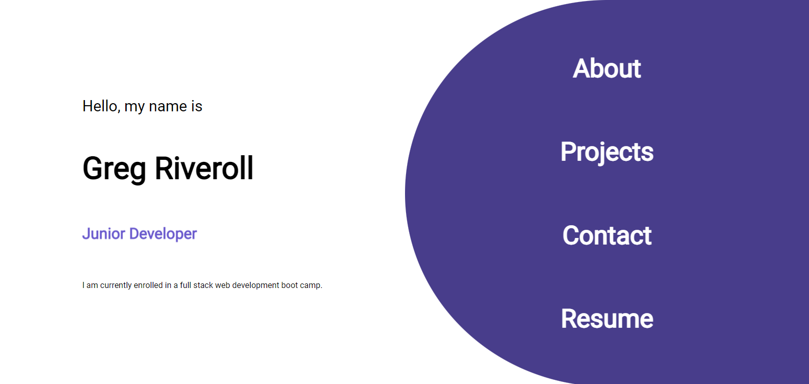

# React Portfolio

## Application Link
[React Portfolio](https://griveroll86.github.io/react-portfolio-too/index.html)

## Description
This assignment asked us to recreate our application using React. A single component for Header, Project and Footer were allowed, plus a Navigation component that could be reused to control the view to sections of the portfolio. Clicking on the title of a project will open a new tab that takes the user to the github repository for the respective project. Clicking on the image will open a new tab that takes the user to the launched application. The contact section in the footer allows users to send an email by filling out the inputs and hitting the submit button.

## Preview

## Contact
If you have any questions or comments, feel free to contact me on [Github](https://github.com/GRiveroll86) anytime. Thank you for your time.